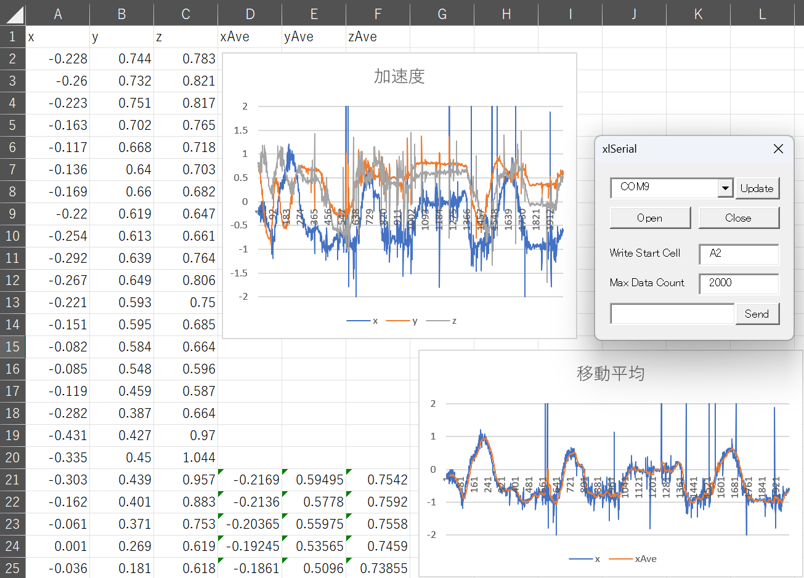
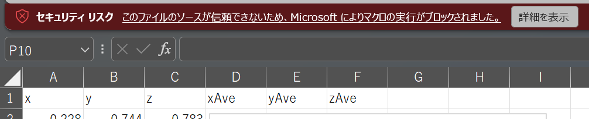
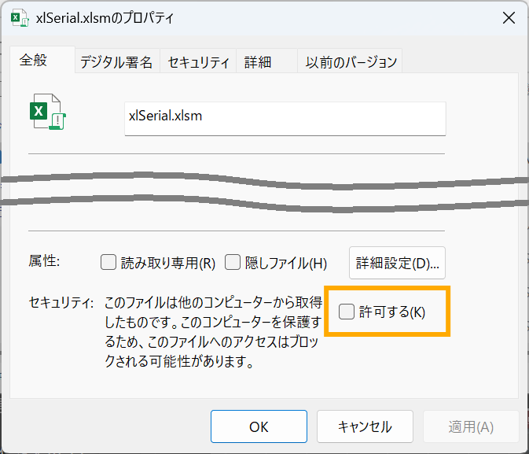
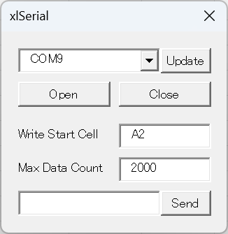

# xlSerial

Excel VBAでシリアル通信するツールです。

ロゴ

使用イメージ

## ファイルの説明

* xlSerial.xlsx : 本体
* IMU_AtomS3 : M5Stack AtomS3の加速度センサ値をシリアル出力するサンプル

## 使用上の注意

ダウンロード直後に「セキュリティリスク」の警告が出てマクロが無効になってしまったときは...

ファイルのプロパティを開き、「セキュリティ」の「許可する」にチェックを入れてください。

## 画面

| 項目 | 説明 |
| - | - |
| COMポート一覧 | COMポートを選択します。 |
| Updateボタン | COMポートの一覧を更新します。 |
| Openボタン | ポートを開き、受信を開始します。受信は1秒間隔で行われます。 |
| Closeボタン | ポートを閉じ、受信を停止します。 |
| Write Start Cell | 受信したデータを書き込む開始セル（左上のセル）をA1形式で指定します。 受信したデータは、改行とカンマで区切られてシートに入力されます。 |
| Max Data Count | 受信したデータを保持する個数を指定します。 データが超過した場合は古いデータから削除され、データがシフトします。 |
| Sendテキストボックス | 送信するデータを入力します。Enterを押すと送信されます。 Enterで送信した場合は、テキストボックスの内容がクリアされます。 |
| Sendボタン | Sendテキストボックスに入力された内容を送信します。 ボタンで送信した場合は、テキストボックスの内容は維持されます。 |

## 同類のツール（Excelでシリアル通信）

* [Data Streamer](https://support.microsoft.com/ja-jp/office/data-streamer-%E3%81%A8%E3%81%AF-1d52ffce-261c-4d7b-8017-89e8ee2b806f)
  * Microsoft製 Excel公式プラグイン
  * データの送信ができない
* [EasyComm](http://www.activecell.jp/)
  * Excel VBA製のシリアル通信モジュール
  * 本ツールに近い
  * 公開/サポートが終了している
* [SequenceMaker](https://sequencemaker.hioki.com/ja/)
  * HIOKI製 Excelから計測器制御するプラグイン
  * コマンドに対する応答を表示するのがメインで自由度が少ない
